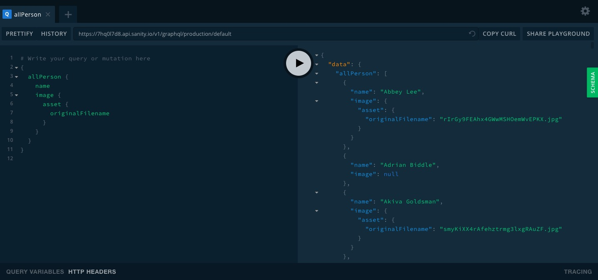

## Gatsby and Netlify Build Plugins POC

---

### Setup

- set up parent repo
- ensure you've got up-to-date Gatsby CLI `npm install -g gatsby-cli`
- use latest version of Gatsby: `yarn add gatsby@latest` & create new Gatsby project `gatsby new frontend`. Cd into it & run `gatsby develop` to test it's working ok.
- launches Gatsby app on http://localhost:8000 & GraphQL playground on http://localhost:8000/___graphql
- add Sanity.io support: `yarn add gatsby-source-sanity`
- global install of Sanity CLI & login: `npm i -g @sanity/cli && sanity login`
- initialise new Sanity project: `sanity init` => gives you config options on the command line, including choice of dummy data
- to delete the imported data, use `sanity dataset delete production`
- create a new clean dataset with `sanity dataset create <name>`
- deploy Sanity GraphQL API: `sanity graphql deploy`
- this will be available on `https://<YOUR_ID>.api.sanity.io/v1/graphql/<YOUR_DATASET>`
- this also makes a GraphQL playground available this endpoint

  

- adjust your gatsby config file to reference the correct id and dataset (e.g. production)

```javascript
    {
      resolve: "gatsby-source-sanity",
      options: {
        projectId: process.env.SANITY_PROJECT_ID,
        dataset: process.env.SANITY_DATASET,
      },
    },
```

- use `dotenv` with .env.development & .env.production to avoid referencing directly in repo
- `sanity start` launches Sanity locally on `http://localhost:3333`

  
  
---

### Troubleshooting

- 'React hooks' error results if versions are not in sync. Best to delete node_modules and use `yarn`

---

### Cypress

- `yarn add -D cypress start-server-and-test`
- `cypress.json`:

```json
{
  "baseUrl": "http://localhost:8000/"
}
```

- test scripts:

```json
  "cy:run": "cypress run",
  "cy:open": "cypress open",
  "test:e2e": "start-server-and-test develop http://localhost:8000 cy:open"
```

- `npm run test:e2e` launches Cypress w Chrome

---

## Netlify Build with Plugins

- add netlify.toml file at root level and point it to the gatsby build output:


```
[build]
base = "frontend/"
command = "npm run build"
publish = "public"
[[plugins]]
package = "netlify-plugin-gatsby-cache"

```

- note the including of the cache:

  >Incremental builds rely on Gatsby’s cache, so we need to enable netlify-plugin-gatsby-cache, which will persist Gatsby’s public and .cache directories between builds. (https://www.netlify.com/blog/2020/04/23/enable-gatsby-incremental-builds-on-netlify/)

- deploy Gatsby site to Netlify using GitHub (master branch default) - remembering to change the publish directory to the frontend/public one rather than the default public
- adjust build script: `"build": "GATSBY_EXPERIMENTAL_PAGE_BUILD_ON_DATA_CHANGES=true gatsby build --log-pages"`

- add Plugins: https://docs.netlify.com/configure-builds/build-plugins/
  
  
- Now any changes to your source data (here in Sanity) will trigger a build where Gatsby will only rebuild affected pages! => Incremental Builds!

  
